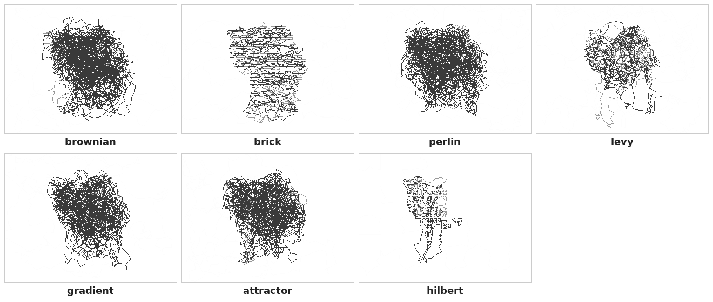

# Routing methods

Each routing method draws **one continuous path** through a color layer's mask. The seven methods differ in *what kind of path* they draw — random, structured, edge-following, chaotic, or deterministic — and that choice shapes the visual character of the final embroidery.

The same input image rendered with each method (`--colors 3 --stitches 800 --seed 42`):

Reproduce with `python examples/render_routing_comparison.py` — the script renders each method's SVG if missing, then composes the strip.

---

## brownian — [`embscript/phase1/routing/brownian.py`](../embscript/phase1/routing/brownian.py)

Density-weighted self-avoiding random walk. At each step the walker picks a candidate direction at random, accepts it if the new position stays inside the mask and clears a spatial-hash check against already-laid stitches, and rejects otherwise. Self-avoidance is tunable via `--overlap-tolerance` (0 = strict, 1 = unrestricted overlap). The result is a tangle of organic scribbles with no visible grain or pattern.

**Reach for it when:** general-purpose shading, naturally textured subjects (skin, fabric, foliage), or any image where you want the stitches to read as "just texture" rather than imposing a pattern of their own.

## brick — [`embscript/phase1/routing/brick.py`](../embscript/phase1/routing/brick.py)

Serpentine masonry fill. The mask is scanned in horizontal strips at a pitch derived from the density field; alternate rows are offset by half a brick so the joins don't line up. Rows are joined by short verticals to keep the path continuous. Within-row stitch pitch shortens in dark regions and lengthens in light ones, so coverage tracks brightness.

**Reach for it when:** logos, lettering, flat color blocks, anything where the thread should read as solid fabric rather than as texture. This is the most "machine-embroidered" look in the set.

## perlin — [`embscript/phase1/routing/perlin.py`](../embscript/phase1/routing/perlin.py)

Walks along a multi-octave value-noise (Perlin-style) field. Adjacent stitches tend to flow in the same direction because the field is smooth, producing soft brushed strokes with a consistent grain across the canvas. Built on the shared `field_walk` helper, so it inherits density-weighted seeding and self-avoidance.

**Reach for it when:** subjects that read as flowing matter — clouds, smoke, hair, fur, water, wind-bent grass. Anything where you want a sense of directionality without imposing a rigid structure.

## levy — [`embscript/phase1/routing/levy.py`](../embscript/phase1/routing/levy.py)

Lévy-flight walk: directions are uniform random, but step lengths are drawn from a heavy-tailed distribution (most steps short, occasional long jumps). The long jumps connect spatially separated mask regions that a purely-local walker would miss.

**Reach for it when:** the subject has disconnected pieces — animal legs and limbs, scattered objects, branched forms. This is the method that lets coverage actually reach the small detached blobs (see [#1](https://github.com/vasil/EmbScript/issues/1) for ongoing work on full coverage guarantees).

## gradient — [`embscript/phase1/routing/gradient.py`](../embscript/phase1/routing/gradient.py)

Direction at each pixel is set perpendicular to the local image gradient — i.e. along edges. The walker traces lines that hug contours and curve around forms rather than ignoring them.

**Reach for it when:** portraits and sculpted subjects, where you want the stitches to *model* the shape. The result reads like cross-hatching that respects the form, similar in spirit to engraving.

## attractor — [`embscript/phase1/routing/attractor.py`](../embscript/phase1/routing/attractor.py)

Direction field driven by a De Jong strange attractor: `fx = sin(a·y) − cos(b·x)`, `fy = sin(c·x) − cos(d·y)`. The chaotic-but-structured field produces ribbons, swirls, and spiral basins that emerge from the four parameters.

**Reach for it when:** decorative, art-poster effects — you want stitches that express the subject rather than literally render it. Suits abstract subjects, backgrounds, and anything where character matters more than fidelity.

## hilbert — [`embscript/phase1/routing/hilbert.py`](../embscript/phase1/routing/hilbert.py)

Deterministic. A Hilbert space-filling curve covers the mask's bounding box; points inside the mask are kept in curve order. No randomness, no spatial-hash overlap check — the curve is self-avoiding by construction.

**Reach for it when:** you want maximally even fill, or reproducibility (same input → same path every time, no `--seed` needed). Also a useful sanity check: if hilbert renders cleanly and another method misbehaves, the problem is in that method, not the mask.

---

## Shared infrastructure

The five chaotic methods (`perlin`, `levy`, `gradient`, `attractor`, plus `brownian` in spirit) share a `field_walk` helper in [`embscript/phase1/routing/_walk.py`](../embscript/phase1/routing/_walk.py): density-weighted seed picking, self-avoidance via spatial hash, jump-on-stuck restart, and a pluggable `sample_angle` callback. Adding a new chaotic method is mostly a matter of writing the angle sampler — see `perlin.py` for the smallest example.

`brick` and `hilbert` don't use `field_walk` because their structure is global rather than local: a row scan and a space-filling curve, respectively.
